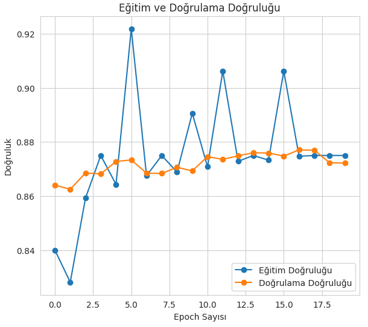
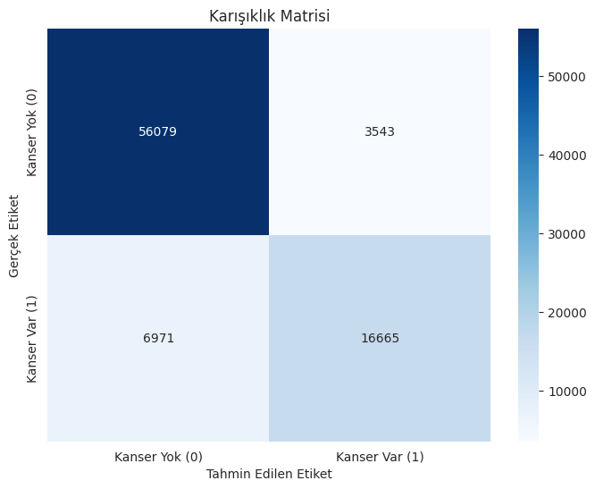

# Meme Kanseri Teşhisi için Derin Öğrenme Modeli ve İnteraktif Web Uygulaması

Bu proje, histopatolojik meme kanseri görüntülerinden derin öğrenme (CNN) modeli ile kanserli dokuları teşhis etmeyi ve bu modeli herkesin kullanabileceği interaktif bir web uygulaması haline getirmeyi amaçlamaktadır.


### 🚀 [Uygulamanın Canlı Demosunu Ziyaret Et!](https://kanser-teshisi-streamlit-app-....streamlit.app/)

---

## Proje Hakkında

Bu çalışma, büyük bir histopatolojik görüntü veri seti kullanılarak eğitilmiş bir Evrişimli Sinir Ağı (CNN) modelini içerir. Model, kendisine verilen 50x50 piksel boyutlarındaki bir doku örneğinin invaziv duktal karsinom (IDC) - yani kanserli - olup olmadığını %87 test doğruluğu ile tahmin edebilmektedir.

Geliştirilen bu model, Python'un Streamlit kütüphanesi kullanılarak kullanıcı dostu bir web arayüzüne entegre edilmiştir. Kullanıcılar, hazır örnekler üzerinden veya kendi görüntü dosyalarını yükleyerek modeli interaktif bir şekilde test edebilirler.

## Kullanılan Teknolojiler

- **Python 3.11**
- **TensorFlow & Keras:** Derin öğrenme modelini oluşturmak, eğitmek ve değerlendirmek için.
- **Streamlit:** Modeli interaktif bir web uygulamasına dönüştürmek için.
- **Pandas & NumPy:** Veri manipülasyonu ve yönetimi için.
- **Scikit-learn:** Model performansını ölçmek (Karışıklık Matrisi, Sınıflandırma Raporu) için.
- **Pillow & Matplotlib/Seaborn:** Görüntü işleme ve görselleştirme için.

## Veri Seti

Projede, Kaggle'da bulunan [Breast Cancer Histopathological Image Dataset](https://www.kaggle.com/datasets/paultimothymooney/breast-histopathology-images) kullanılmıştır. Veri seti, invaziv duktal karsinom (IDC) pozitif ve negatif olarak etiketlenmiş, 50x50 piksel boyutlarında yaklaşık 277,000 adet doku görüntüsü içermektedir.

## Model Mimarisi ve Sonuçlar

Model, 3 adet Conv2D ve MaxPooling2D bloğundan oluşan bir özellik çıkarım katmanı ve ardından sınıflandırma için bir Dense katmanından oluşmaktadır. Aşırı öğrenmeyi (overfitting) engellemek için Dropout tekniği kullanılmıştır.

- **Optimizasyon Algoritması:** Adam
- **Kayıp Fonksiyonu:** Binary Crossentropy
- **Nihai Test Doğruluğu:** **~87%**

#### Öğrenme Eğrileri



#### Karışıklık Matrisi



Analizler, modelin özellikle "Kanser Var" sınıfını yüksek bir duyarlılık (recall) ile tespit edebildiğini göstermektedir. Bu, tıbbi teşhis uygulamalarında en çok aranan özelliklerden biridir.

---

## Kurulum ve Çalıştırma

Bu projeyi kendi bilgisayarınızda çalıştırmak için aşağıdaki adımları izleyebilirsiniz:

1.  **Repoyu klonlayın:**

    ```bash
    git clone https://github.com/anilbeter/kanser-teshisi-streamlit.git
    cd kanser-teshisi-streamlit
    ```

2.  **Sanal ortam oluşturun ve aktif edin:**

    ```bash
    # Sanal ortamı oluştur
    python -m venv venv

    # Windows için
    venv\Scripts\activate

    # macOS/Linux için
    source venv/bin/activate
    ```

3.  **Gerekli kütüphaneleri yükleyin:**

    ```bash
    pip install -r requirements.txt
    ```

4.  **Streamlit uygulamasını başlatın:**
    ```bash
    streamlit run app.py
    ```
    Uygulama, varsayılan web tarayıcınızda açılacaktır.

## Gelecek Geliştirmeler

- [ ] Eğitim sürecindeki kararsızlığı azaltmak için öğrenme oranı (learning rate) ayarlaması (tuning).
- [ ] Daha karmaşık CNN mimarileri veya Transfer Learning (VGG16, ResNet gibi) teknikleri ile model doğruluğunu artırma denemeleri.
- [ ] Kullanıcının yüklediği büyük bir görüntüyü otomatik olarak 50x50'lik parçalara ayırıp her birini analiz eden bir özellik ekleme.
